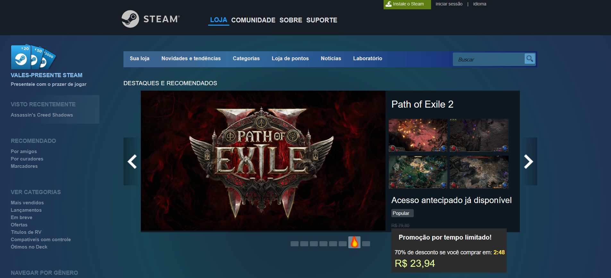

Acesso: https://elc1090.github.io/project1-2025a-apfmota/

#### Desenvolvedor(a)
Andriel Prieto Fernandes Mota - Ciência da Computação

#### Cliente
Murilo Leal

#### Site/app original
Loja Steam

##### Link
https://store.steampowered.com/

##### Descrição
A Steam é uma loja virtual de jogos digitais.

#### Demanda do(a) cliente
Ter uma oferta exclusiva de algum jogo por tempo limitado e mostrar um contador desse tempo.

#### Desenvolvimento

Utilizei as ferramentas de desenvolver do navegador para entender a estrutura do site e copiar os estilos e imagens. Montei um JSON com os dados sobre os jogos e optei por adicionar a funcionalidade de oferta com tempo limitado na seção de jogos em destaque da loja.

#### Tecnologias

- React (JS)
- HTML
- CSS

#### Ambiente de desenvolvimento

Substitua este trecho por uma lista detalhada dos ambientes/ferramentas de desenvolvimento que você usou (por exemplo, VS Code + alguma extensão, etc.)
- VS Code
- CSS Gradient (ferramenta para gerar gradientes CSS)

#### Referências e créditos

Substitua este trecho por uma lista bem detalhada de todo material que você consultou para ajudar no projeto, por exemplo:  URL de templates usados, URL de icon kits usados, créditos para colegas que colaboraram, geradores de código (incluindo alguns prompts usados para o ChatGPT, se for o caso)
- MDN Web Docs (principalmente para propriedades CSS)
- Stack OverFlow (questões sobre erros com React e GitHub Pages)
- Chat GPT (utilizado principalmente para perguntas sobre o funcionamento de tags customizadas do React, uso de useEffect e como utilizar o GitHub Pages)

---
Projeto entregue para a disciplina de [Desenvolvimento de Software para a Web](http://github.com/andreainfufsm/elc1090-2025a) em 2025a
